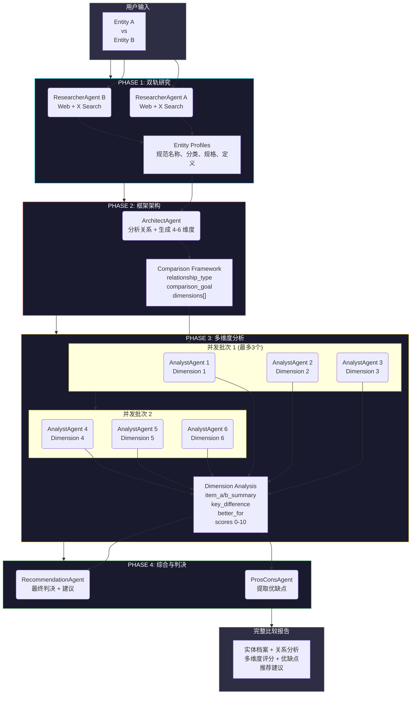

# 🔍 CompareAI

<div align="center">

**AI 驱动的智能比较工具 - 让任何两个实体的对比变得清晰透明**

[](https://www.typescriptlang.org/)
[](https://reactjs.org/)
[](https://vitejs.dev/)
[](https://tailwindcss.com/)
[](https://x.ai/)

</div>

---

## 📖 项目简介

CompareAI 是一个基于多智能体 AI 架构的智能比较工具，能够对任意两个实体（产品、概念、技术等）进行深度、多维度的对比分析。

### ✨ 核心特性

- 🤖 **多智能体协作** - 4 阶段 AI Pipeline，每个阶段由专门的 Agent 负责
- 🌐 **双轨研究** - 同时使用 Web 搜索和 X (Twitter) 搜索获取全面信息
- 📊 **动态维度生成** - 根据实体特性自动生成 4-6 个定制化比较维度
- ⚡ **并发处理** - 智能并发控制，最大化处理速度同时避免 API 限流
- 🎨 **现代化 UI** - Glassmorphism 设计风格，流畅的动画效果
- 📈 **可视化图表** - 使用 Recharts 展示多维度评分对比

---

## 🏗️ 技术栈

| 类别 | 技术 | 用途 |
|------|------|------|
| **前端框架** | React 19 | UI 组件和状态管理 |
| **构建工具** | Vite 6.2 | 快速开发和构建 |
| **语言** | TypeScript 5.8 | 类型安全的开发体验 |
| **样式** | Tailwind CSS 4.1 | 实用优先的 CSS 框架 |
| **动画** | Motion (Framer Motion) | 流畅的 UI 动画 |
| **图表** | Recharts 3.8 | 数据可视化 |
| **AI 模型** | Grok 4.1 Fast Reasoning | 多智能体推理引擎 |
| **图标** | Lucide React | 现代化图标库 |

---

## 🧠 Multi-Agent AI Pipeline 架构

CompareAI 的核心是一个精心设计的 4 阶段多智能体 AI Pipeline，每个阶段由专门的 Agent 负责特定任务。

### 📐 Pipeline 流程图



### 🔄 并发控制策略

```typescript
// Phase 1: 完全并发 (2 个 ResearcherAgent)
const [profileA, profileB] = await Promise.all([
  runResearcherAgent(itemA),
  runResearcherAgent(itemB)
]);

// Phase 3: 限制并发 (每次最多 3 个 AnalystAgent)
const analyzedDimensions = await mapConcurrent(
  framework.dimensions,
  3,  // 并发限制
  async (dim) => runAnalystAgent(profileA, profileB, dim)
);

// Phase 4: 完全并发 (2 个 Agent)
const [prosCons, recommendation] = await Promise.all([
  runProsConsAgent(profileA, profileB, analyzedDimensions),
  runRecommendationAgent(profileA, profileB, analyzedDimensions, null)
]);
```

---

## 🎯 Agent 详细说明

### 1️⃣ ResearcherAgent (研究员)

**职责**: 收集实体的全面信息

**输入**: 实体名称 (string)

**处理流程**:
1. **双轨搜索** (并发执行):
   - Web Search: 官方规格、专家评测、最新更新
   - X Search: 用户体验、真实反馈、热门讨论
2. **结构化提取**: 使用 `grok-4-1-fast-reasoning` 模型将搜索结果转换为结构化数据

**输出** (JSON Schema):
```json
{
  "name": "原始名称",
  "normalized_name": "规范化名称",
  "category": "主分类",
  "subcategory": "子分类",
  "likely_domain": "所属领域",
  "short_definition": "简短定义",
  "key_specs": ["关键规格1", "关键规格2", ...]
}
```

**使用的 API**:
- `responses.create()` with `web_search` tool
- `responses.create()` with `x_search` tool
- `chat.completions.create()` with JSON Schema

---

### 2️⃣ ArchitectAgent (架构师)

**职责**: 设计定制化的比较框架

**输入**: 两个实体的完整档案

**处理流程**:
1. 分析两个实体的关系类型 (same_category, cross_category, etc.)
2. 确定比较目标和可比性
3. 根据实体特性生成 4-6 个定制化维度（避免使用通用模板）

**输出** (JSON Schema):
```json
{
  "relationship": {
    "relationship_type": "关系类型",
    "comparison_goal": "比较目标",
    "can_directly_compare": true/false,
    "reasoning": "推理过程"
  },
  "dimensions": [
    {
      "key": "dimension_key",
      "label": "维度名称",
      "why_it_matters": "为什么重要",
      "comparison_angle": "比较角度"
    }
  ]
}
```

**特点**:
- 动态生成维度，不使用固定模板
- 根据实体类型调整比较策略
- Temperature: 0.2 (保持一定创造性)

---

### 3️⃣ AnalystAgent (分析师)

**职责**: 在单个维度上深度分析两个实体

**输入**:
- 两个实体档案
- 单个比较维度

**处理流程**:
1. 专注于指定维度进行对比
2. 总结每个实体在该维度的表现
3. 识别关键差异
4. 给出 0-10 分评分

**输出** (JSON Schema):
```json
{
  "item_a_summary": "实体 A 在该维度的表现",
  "item_b_summary": "实体 B 在该维度的表现",
  "key_difference": "关键差异",
  "better_for": "A/B/Both/Neither",
  "optional_score_a": 8.5,
  "optional_score_b": 7.2
}
```

**并发控制**:
- 使用 `mapConcurrent` 函数限制并发数为 3
- 避免触发 API 速率限制
- 保持高效的处理速度

---

### 4️⃣ ProsConsAgent (优缺点分析师)

**职责**: 提取每个实体的优缺点

**输入**:
- 两个实体档案
- 所有维度的分析结果

**输出** (JSON Schema):
```json
{
  "item_a_pros": ["优点1", "优点2", ...],
  "item_a_cons": ["缺点1", "缺点2", ...],
  "item_b_pros": ["优点1", "优点2", ...],
  "item_b_cons": ["缺点1", "缺点2", ...]
}
```

---

### 5️⃣ RecommendationAgent (推荐顾问)

**职责**: 提供最终判决和选择建议

**输入**:
- 两个实体档案
- 所有维度的分析结果
- 优缺点分析

**输出** (JSON Schema):
```json
{
  "best_for_a": ["适合场景1", "适合场景2", ...],
  "best_for_b": ["适合场景1", "适合场景2", ...],
  "which_to_choose_first": "首选建议",
  "when_not_to_compare_directly": "不适合直接比较的情况",
  "short_verdict": "简短结论",
  "long_verdict": "详细判决"
}
```

---

## 🚀 快速开始

### 前置要求

- Node.js 18+
- npm 或 yarn
- Grok API Key (从 [x.ai](https://x.ai/) 获取)

### 安装步骤

1. **克隆仓库**
```bash
git clone git@github.com:Kenneth0416/CompareAI.git
cd compare-ai
```

2. **安装依赖**
```bash
npm install
```

3. **配置环境变量**

创建 `.env.local` 文件:
```env
XAI_API_KEY=your_grok_api_key_here
```

> ⚠️ **注意**: API Key 在构建时通过 Vite 的 `define` 配置注入，不会暴露在客户端代码中。

4. **启动开发服务器**
```bash
npm run dev
```

应用将在 `http://localhost:3000` 启动。

### 其他命令

```bash
# 类型检查
npm run lint

# 生产构建
npm run build

# 预览生产构建
npm run preview

# 清理构建产物
npm run clean
```

---

## 📁 项目结构

```
compare-ai/
├── src/
│   ├── components/
│   │   ├── AILoadingState.tsx      # AI 加载动画和进度显示
│   │   ├── ComparisonCard.tsx      # 单个维度比较卡片
│   │   ├── ComparisonGrid.tsx      # 响应式网格布局
│   │   └── DimensionChart.tsx      # Recharts 雷达图/柱状图
│   ├── services/
│   │   └── geminiService.ts        # 所有 AI Agent 逻辑和 API 调用
│   ├── App.tsx                     # 主应用组件
│   ├── main.tsx                    # 应用入口
│   └── index.css                   # 全局样式和 Tailwind 配置
├── public/                         # 静态资源
├── .env.example                    # 环境变量示例
├── .env.local                      # 本地环境变量 (不提交)
├── vite.config.ts                  # Vite 配置
├── tsconfig.json                   # TypeScript 配置
├── package.json                    # 项目依赖
├── CLAUDE.md                       # Claude Code 项目指南
└── README.md                       # 项目文档
```

---

## 🎨 UI 特性

### Glassmorphism 设计

- 半透明背景 (`bg-white/10`)
- 模糊效果 (`backdrop-blur-xl`)
- 渐变边框和阴影
- 流畅的悬停动画

### 响应式布局

- 移动端: 单列布局
- 平板: 2 列网格
- 桌面: 3 列网格
- 自适应卡片高度

### 动画效果

使用 Motion (Framer Motion) 实现:
- 淡入动画 (`fadeIn`)
- 交错动画 (`stagger`)
- 悬停缩放效果
- 加载状态动画

---

## 🔧 开发指南

### 添加新的比较维度

修改 `src/services/geminiService.ts` 中的 `ArchitectAgent` prompt:

```typescript
async function runArchitectAgent(profileA: any, profileB: any) {
  const prompt = `You are an Architect Agent. Based on the following profiles,
  determine their relationship and generate 4 to 6 key dimensions to compare them on.

  // 在这里添加你的自定义指导

  Profile A: ${JSON.stringify(profileA)}
  Profile B: ${JSON.stringify(profileB)}`;

  // ...
}
```

### 更换 AI 模型

当前使用的模型: `grok-4-1-fast-reasoning`

可用的 Grok 模型:
- `grok-4-1-fast-reasoning` (推荐，支持 JSON Schema)
- `grok-4-1-fast-non-reasoning`
- `grok-4-fast-reasoning`
- `grok-4-fast-non-reasoning`
- `grok-code-fast-1`
- `grok-4`, `grok-3`, `grok-3-mini`
- `grok-2-vision-1212`, `grok-2-image-1212`

修改所有 Agent 函数中的 `model` 参数:

```typescript
const response = await openai.chat.completions.create({
  model: 'grok-4-1-fast-reasoning',  // 修改这里
  // ...
});
```

### 调整并发限制

修改 Phase 3 中的并发限制:

```typescript
// 当前限制: 3 个并发请求
const analyzedDimensions = await mapConcurrent(
  framework.dimensions,
  3,  // 修改这个数字
  async (dim) => runAnalystAgent(profileA, profileB, dim)
);
```

⚠️ **注意**: 提高并发数可能触发 API 速率限制。

### 禁用 HMR (热模块替换)

在 AI Studio 或其他环境中，可以通过环境变量禁用 HMR:

```env
DISABLE_HMR=true
```

---

## 📊 数据流


---

## 🤝 贡献指南

欢迎贡献！请遵循以下步骤:

1. Fork 本仓库
2. 创建特性分支 (`git checkout -b feature/AmazingFeature`)
3. 提交更改 (`git commit -m 'Add some AmazingFeature'`)
4. 推送到分支 (`git push origin feature/AmazingFeature`)
5. 开启 Pull Request

### 代码规范

- 使用 TypeScript 严格模式
- 遵循 React Hooks 最佳实践
- 优先使用函数式组件
- 使用 Tailwind 实用类，避免自定义 CSS
- 保持组件职责单一

---

## 📝 许可证

本项目采用 MIT 许可证 - 详见 [LICENSE](LICENSE) 文件。

---

## 🙏 致谢

- [Grok AI](https://x.ai/) - 强大的 AI 推理引擎
- [React](https://reactjs.org/) - UI 框架
- [Vite](https://vitejs.dev/) - 快速构建工具
- [Tailwind CSS](https://tailwindcss.com/) - 实用优先的 CSS 框架
- [Recharts](https://recharts.org/) - 数据可视化库
- [Lucide](https://lucide.dev/) - 精美的图标库

---

## 📧 联系方式

如有问题或建议，请通过以下方式联系:

- GitHub Issues: [提交 Issue](https://github.com/Kenneth0416/CompareAI/issues)
- Email: your.email@example.com

---

<div align="center">

**⭐ 如果这个项目对你有帮助，请给个 Star！**

Made with ❤️ by Kenneth

</div>
